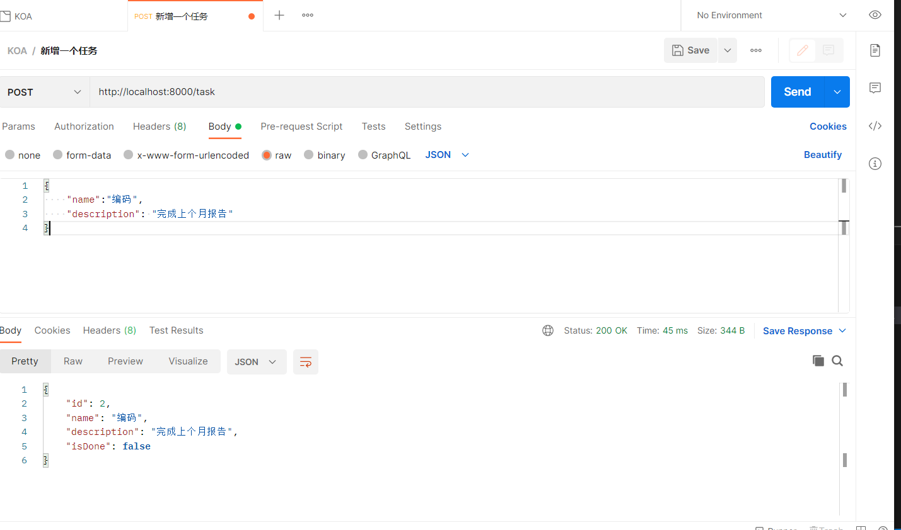
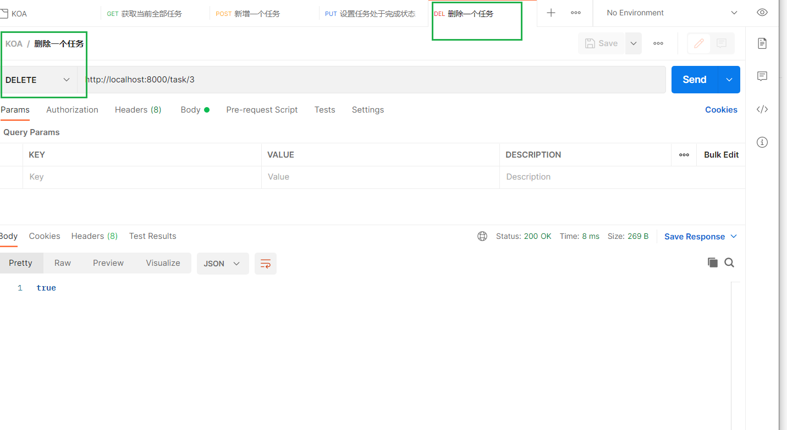
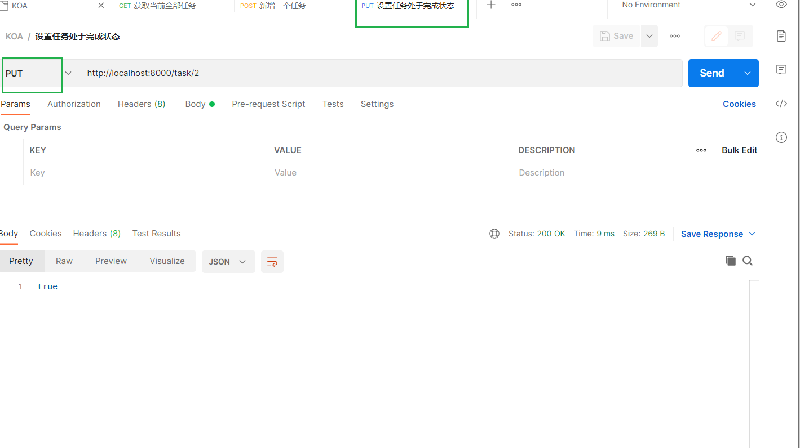
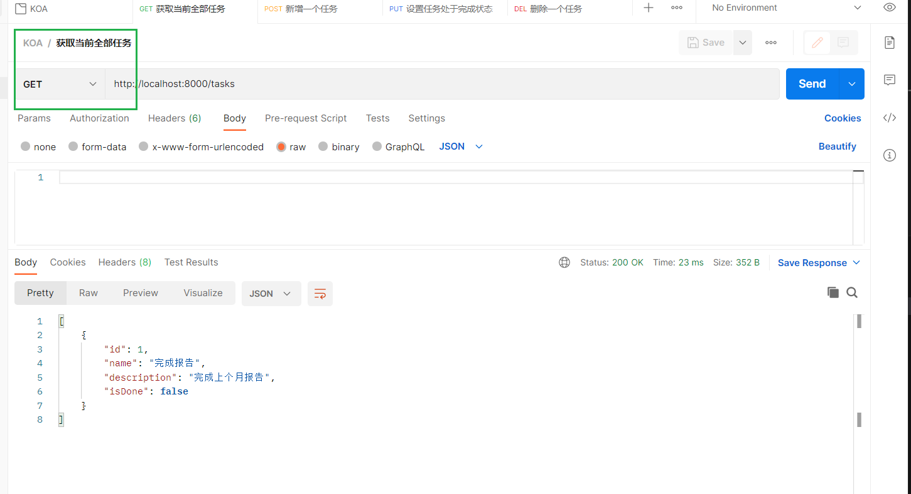
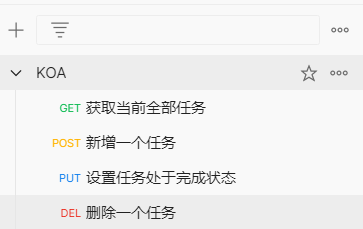

## 【后端】使用TS编写任务管理系统----Express
[TOC]

```
node -v
v16.13.0
```

https://github.com/dL-hx/server-side

## 常见的后端框架
- express
- koa
- ...

## 安装并且声明文件库
```shell
$ npm i express 
$ npm i @types/express -D
```


## 项目基本配置
添加`ts.config`
```shell
$ npx tsc --init
```
``
```json
{
  "compilerOptions": {
    "target": "es2016",
    "module": "commonjs" /* Specify what module code is generated. */,
    "esModuleInterop": true /* Emit additional JavaScript to ease support for importing CommonJS modules. This enables 'allowSyntheticDefaultImports' for type compatibility. */,
    "forceConsistentCasingInFileNames": true /* Ensure that casing is correct in imports. */,
    "strict": true /* Enable all strict type-checking options. */,
    "skipLibCheck": true /* Skip type checking all .d.ts files. */,
    "rootDir": "./src" /* Specify the root folder within your source files. */,
    "outDir": "./dist"
  }
}

```

添加server文件
`src/index.ts`

```ts
import express from "express";
const app = express();
const port = 8000;

app.get("/hello", (req, res) => {
  res.send("hello world");
});

app.listen(port, () => {
  console.log("listening at http://localhost:" + port);
});

```

通过导入express对象, 并用app.get 创建 /hello 路由,  访问http://localhost:8000/hello,
服务器返回"hello world", 然后在监听8000端口提供服务


通过`tsc`命令, 编译`src`目录下所有文件,   在通过node命令启动输出后的所有的javascript文件
```ts
$ tsc
$ node dist/index.js
```


添加"main",与"start"字段完成项目基本配置,
后面可以直接执行`npm start` 命令启动服务

`package.json`
```json
{
  "name": "service-side",
  "description": "[TOC]",
  "version": "1.0.0",
+ "main": "dist/index.js",
  "scripts": {
+   "start": "npx tsc && node dist/index.js",
    "test": "echo \"Error: no test specified\" && exit 1"
  },
  "author": "",
  "license": "ISC",
  "dependencies": {
    "express": "^4.18.2"
  },
  "devDependencies": {
    "@types/express": "^4.17.17"
  }
}

```


## 编写任务管理后端API
安装cors库支持跨域访问
```shell
$ npm i express cors
$ npm i @types/express @types/cors -D
```

├─dist
├─node_modules
├─README
└─src
|---index.ts
|---TaskAccess.ts
|---type.d.ts

`src/type.d.ts`
```ts
interface Task {
    // id
    id:number;
    // 名称
    name:string;
    // 描述
    description: string;
    // 是否完成
    isDone:boolean;
}

// 定义了表示Task的接口,供其他Typescript文件引用
```

### 添加任务
### 查看任务
### 设置任务完成状态
### 删除任务

`src/TaskAccess.ts`
```ts
class TaskAccessor {
  tasks: Task[] = [
    {
      id: 1,
      name: "完成报告",
      description: "完成上个月报告",
      isDone: false,
    },
  ];
  taskIdIndex = 1;

  addTask(task: Task): Task {
    let newTask = {
      id: ++this.taskIdIndex,
      name: task.name,
      description: task.description,
      isDone: false,
    };
    this.tasks.push(newTask);
    return newTask;
  }

  deleteTask(taskId: number): boolean {
    let index = this.tasks.findIndex((p) => p.id == taskId);
    if (index < 0) {//未找到
      return false;
    }
    // 找到了删除
    this.tasks.splice(index, 1)
    return true;
  }

  setTaskDone(taskId:number):boolean{
    let index = this.tasks.findIndex((p) => p.id == taskId);
    if (index < 0) {// 未找到
      return false;
    }
    // 找到了,修改isDone为完成
    this.tasks[index].isDone = true
    return true;
  }
}
export const taskAccessor = new TaskAccessor();

/**
 * 该文件提供了Task数据访问功能. 声明了TaskAccessor类,在代码最后实例化了该类并将其赋值给变量taskAccessor,然后以模块形式导出
 * 
 * 下面分别介绍TaskAccessor类中的成员:
 * 
 * - task属性:用于存放Task数组,并将其中初始化一个名称为"完成报告"的Task
 * 
 * - taskIdIndex属性:用于存放当前最大的Task id,用于实现新建的Task id的自增
 * 
 * - addTask(task: Task): Task  方法:要求传入一个新增的Task对象,传入的Task对象中需要包含number ,description属性.id属性根据taskIdIndex自增,而
 * isDone属性默认为false.新的Task对象将放到tasks数组中,返回值为当前新增的Task对象.
 * 
 * - deleteTask(taskId: number): boolean方法:要求传入待删除的Task id, 返回值表示是否成功删除.如果没有找到匹配传入的id的Task,则表示删除失败.
 * 如果找到,则执行删除操作并返回true. 表示删除成功
 * 
 * - setTaskDone(taskId:number):boolean方法:要求传入已完成的Task id,返回值表示是否成功将Task 设置为已完成.如果没有找到匹配传入的id的Task,则表示设置失败,
 * 返回false.如果找到则将Task 的isDone属性设置为true并返回true
 * 
 */
```

`src/index.ts`
```ts
import express, { json } from "express";
import cors from "cors";
import { taskAccessor } from "./TaskAccess";
const app = express();
const port = 8000;

// 由于各个路由请求中都涉及了Json对象的转换,因此需要引入json中间件
app.use(express.json());

// 在前端中调用下面的API,涉及跨域访问,需引入cors中间件
app.use(cors());

app.get("/task", (req, res) => {
  res.send(taskAccessor.tasks);
});

app.post("/task", (req, res) => {
  const { name, description } = req.body;
  if (!name?.trim() || !description?.trim()) {
    return res.status(400).send('Name or description is null.')
  }
  let newTask = taskAccessor.addTask(req.body)
  res.status(200).send(newTask);
});

app.delete("/task/:id", (req, res) => {
  let deleteSuccess = taskAccessor.deleteTask(Number(req.params.id))
  if (!deleteSuccess) {
    return res.status(400).send('Task does not exist.')
  }
  res.status(200).send(deleteSuccess);
})


app.put("/task/:id", (req, res) => {
  let setSuccess = taskAccessor.setTaskDone(Number(req.params.id))
  if (!setSuccess) {
    return res.status(400).send('Task does not exist.')
  }
  res.status(200).send(setSuccess);
})


app.listen(port, () => {
  console.log("Express is listening at http://localhost:" + port);
});

/**
 * 该文件用于提供后端服务,引用TaskAccess模块来查询或修改Task数据, 并将通过不同路由发布不同的数据操作API.
 * 
 * 介绍index.ts文件中各个方法的作用:
 * -app.use(...).   引入中间件.这里引入了两个中间件,分别为json和cors.  json中间件用于处理各个路由请求中,涉及Json对象转换,
 * cors中间件用于支持前端页面以跨域形式调用各个API.
 * 
 * - app.get("/task")    获取全部的Task数据的API
 * 
 * 
 * - app.post("/task")   创建Task的API.
 * 如果传入的name属性和description属性为空值, 将返回HTTP状态码400;
 * 如果传入的Task内容正确, 则调用taskAccessor的addTask()方法新增Task,然后返回新增的Task,且HTTP状态码为200
 * 
 * 
 * - app.delete("/task/:id")   删除Task的API,将调用taskAccessor的deleteTask()方法.
 * 如果删除失败,则返回HTTP状态码400;
 * 如果成功,则返回true,且HTTP状态码为200
 * 
 * - app.put("/task/:id")   设置Task任务为已完成的API,将调用taskAccessor的setTaskDone()方法.
 * 如果设置失败,则返回HTTP状态码400;
 * 如果成功,则返回true,且HTTP状态码为200
 */
```

之后,你可以通过使用如Postman 等的API工具来访问这些API.
首先执行`npm start`命令启动后端服务.然后
- 通过Postman 调用`/task POST API`,新增一个任务


- 调用`/task/:id DELETE API`, 删除一个任务


- 调用`/task/:id PUT API`, 设置任务处于完成状态

- 最后调用`/task GET API`, 获取当前的全部任务






## 总结
- 最后因为数据都是在内存中存入的,所以需要json文件/使用数据库保存这里的数据,做数据的持久化


